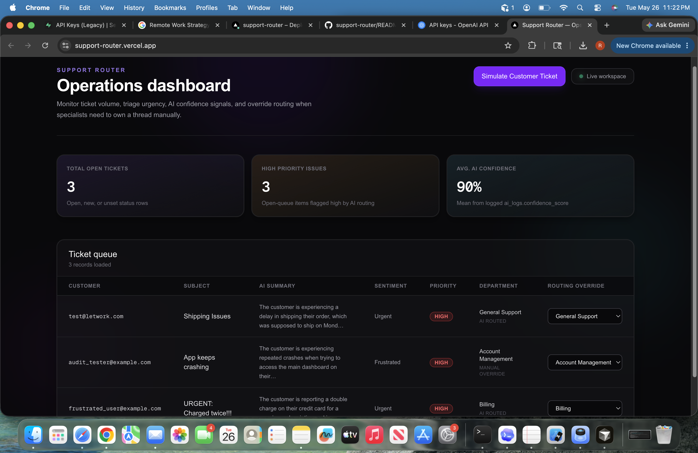
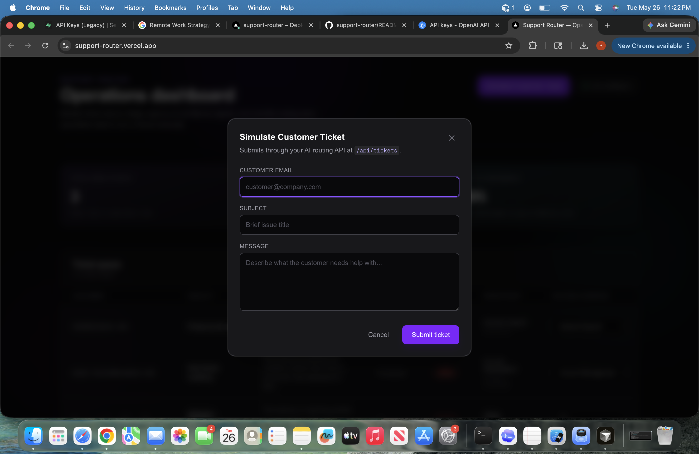
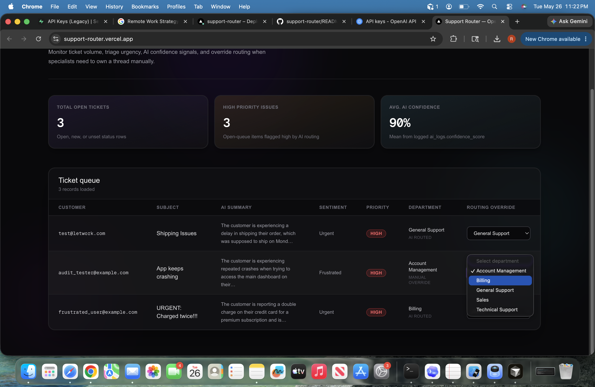

# Support Router

## Quick Summary

- **Built with:** **Next.js** (web app & dashboard), **Supabase / PostgreSQL** (live data store), **OpenAI** (routes and labels each ticket).
- **What it solves:** Incoming support messages get **automatic classification**—priority, tone, summary, and the right department—without an agent opening every ticket first.
- **Humans stay in charge:** Operators can **override** the routed department anytime; those decisions are tracked so workflows stay trustworthy.
- **Audit-ready:** Every AI run leaves a **structured log** tied to tickets so reviews, debugging, and compliance-style questions have a paper trail—not a black box.

**🔗 Live Production Deployment:** [https://support-router.vercel.app/](https://support-router.vercel.app/)

---

## Project Preview



### Live operations dashboard — metrics & ticket queue

Supabase-backed KPIs (open volume, high-priority load, mean AI confidence from `ai_logs`) sit above a live ticket table: every row is authoritative Postgres state produced or updated by the routing pipeline and overrides.



### Simulate Customer Ticket — ingestion without internal tools

Visitors exercise the same **`POST /api/tickets`** production path the API would use—OpenAI JSON classification, department resolution, synchronous ticket + `ai_logs` writes, then client `router.refresh()` to surface the routed row.



### Routing override — accountable human ownership

Each `<select>` invokes a Server Action to repoint `department_id` and clears `ai_routed` so analysts can see at a glance whether assignment was model-driven or operator-corrected—without erasing AI-generated summaries.

A production-oriented reference implementation of **AI-assisted inbound support routing**: classify and prioritize customer messages with a deterministic database contract, observable audit trails, and explicit human override semantics.

This repository is documented as a **technical case study**—oriented toward systems design, reliability boundaries, and operational trade-offs rather than “AI demos.”

---

## 1. Project overview

### Business problem

Operational support teams face recurring overhead from **manual triage**: reading every message, guessing urgency, and assigning ownership across functional silos. That work does not scale linearly with volume; it also introduces inconsistency (two agents route the same pattern differently) and delays first meaningful response.

### Technical solution

**Support Router** automates the *classification and routing* step while keeping humans in control of the final queue:

1. **Ingest** structured ticket payloads (`customer_email`, `subject`, `message`) via a server-side HTTP API.
2. **Ground** model output in curated business data by loading authoritative `departments` from Postgres and constraining outputs to known department names.
3. **Normalize** routing output with a tight JSON schema (sentiment, priority, summary, suggested department).
4. **Persist** immutable facts in `tickets` and append forensic detail to `ai_logs` for auditing and regression analysis.
5. **Expose** an operator dashboard where staff can override `department_id` and flip `ai_routed` to indicate manual ownership—without rewriting history.

The system is deliberately **narrow in scope**: it does not pretend to draft customer replies end-to-end; it focuses on routing state and telemetry that integrate with downstream tools (Zendesk-like queues, Slack, CRM) if extended.

---

## 2. Technical architecture summary

### Runtime and UI

| Layer | Choice | Role |
|--------|--------|------|
| **Framework** | [Next.js 16](https://nextjs.org/) **App Router** | Server-first rendering for dashboard metrics and ticket tables; Route Handlers for ingestion; React Server Actions for privileged updates |
| **Styling** | [Tailwind CSS v4](https://tailwindcss.com/) (`@tailwindcss/postcss`) | Dark-mode dashboard, dense operations table, modal flows |
| **Client islands** | React 19 | Local UI state (modals, dropdowns, `router.refresh()` after mutations) |

### Data and auth surface

| Layer | Choice | Role |
|--------|--------|------|
| **Database** | [Supabase](https://supabase.com/) on **PostgreSQL** | Source of truth for `departments`, `tickets`, `ai_logs` |
| **Server access pattern** | `@supabase/supabase-js` `createClient` | Node / Route Handler / RSC paths use URL + **service role** (recommended) or publishable key with explicit RLS policies |
| **Browser demo** | `POST /api/tickets` + `router.refresh()` | “Simulate Customer Ticket” pattern for evaluators without internal auth |

`@supabase/ssr` remains in the dependency tree for optional cookie-bound clients (`utils/supabase/server.ts`, `client.ts`); **the shipped production path for the public dashboard and ingestion API does not depend on Edge middleware** (see [§4](#4-debugging-and-production-roadblocks-vercel)).

### Intelligence pipeline

| Component | Choice | Role |
|-----------|--------|------|
| **Model** | OpenAI **Chat Completions**, default **`gpt-4o-mini`** (`OPENAI_MODEL` override) | Cost/latency trade-off appropriate for classification |
| **Contract** | `response_format: { type: "json_object" }` + prompt-enforced field list | Reduces free-text drift; server-side validation rejects incomplete payloads |
| **Transport** | `fetch` to `https://api.openai.com/v1/chat/completions` | No extra SDK surface in the hot path; errors surfaced as HTTP + JSON to callers |

---

## 3. Engineering highlights

- **Data ingestion pipeline (`POST /api/tickets`)**  
  - Validates input, loads `departments`, builds a **closed-world** prompt (only enumerated department names are valid model outputs).  
  - Resolves `department_id` via **normalized string equality** (trim, case fold, collapsed whitespace) to tolerate minor formatting variance while staying deterministic.  
  - Inserts the routed row into `tickets` with `ai_routed: true` on successful automated placement.

- **Structured JSON parsing schema**  
  - Required assistant fields: `sentiment`, `ai_priority` ∈ {`low`,`medium`,`high`}, `ai_summary`, `department_name` (must match list), `confidence` ∈ [0, 1].  
  - Parser rejects partial objects before any ticket row is committed, reducing “half-written” business state.

- **Transactional audit model (`ai_logs`)**  
  - Columns: `ticket_id` (nullable when classification fails before insert), `raw_prompt`, `raw_response` (JSON text), `confidence_score`.  
  - Writes occur on success and several failure modes (model error, department mismatch, DB insert failure) with **dual `console.error` patterns** on insert failure for fast production triage.

- **Human-in-the-loop override (`ai_routed` + Server Action)**  
  - Dashboard rows expose a department `<select>` bound to seeded `departments`.  
  - `overrideTicketDepartment` updates `department_id` and sets **`ai_routed: false`**, signalling manual routing without deleting AI-derived summaries.  
  - `revalidatePath("/")` keeps RSC payloads coherent after override.

- **Observability split**  
  - **Operational queue**: `app/page.tsx` aggregates open-ish ticket counts (status OR-filter with fallbacks), high-priority counts, and **mean confidence** computed from `ai_logs` via an application-layer average.

---

## 4. Debugging and production roadblocks (Vercel)

### Symptom

Production deployments on Vercel intermittently surfaced **`MIDDLEWARE_INVOCATION_FAILED`** for the primary document route (`/`). Failures clustered around **Edge middleware execution**, not PostgreSQL latency or OpenAI quotas.

### Diagnosis

The failure mode was traced to **split runtime semantics**:

1. **Edge middleware** historically invoked `@supabase/ssr`’s `createServerClient`, wiring request/response cookie adapters and calling `supabase.auth.getUser()` per request—even for **anonymous** traffic and for routes that load data strictly from a server-side Postgres client unrelated to visitor cookies.

2. **Server Components and Route Handlers** run on the **Node execution path**, where environment binding, networking, and error surfaces differ from the Edge bundle. Combining those two transports without strict separation meant that **initialization assumptions valid in one runtime failed in another** when env vars were missing at the Edge layer or when cookie/session bookkeeping threw inside middleware.

This is fundamentally a **systems boundary** issue: the Edge layer was doing session refresh work unrelated to anonymous dashboard reads, widening the blast radius of any `@supabase/ssr` mismatch.

### Resolution (decoupled client initialization)

The fix was engineered as **orthogonalization**, not patching in place:

1. **Eliminated Next.js middleware** from the codebase—no Edge invocation on the routing layer, ergo no Edge-scoped `@supabase/ssr` lifecycle for homepage traffic.

2. **Separated server data access constructors** explicitly:  
   - **Dashboard reads** (`app/page.tsx`) use `@supabase/supabase-js` with `persistSession: false`, `autoRefreshToken: false`, and keys resolved from **`SUPABASE_SERVICE_ROLE_KEY`** (preferred) or **`NEXT_PUBLIC_SUPABASE_PUBLISHABLE_KEY`**.  
   - **Ingester** (`app/api/tickets/route.ts`) uses the same library with identical non-session semantics for inserts and audits.

   This decouples “**who is the Postgres principal**?” from “**whose browser cookies matter?**” Anonymous recruiters hit a **stateless principal** bounded by Vault-like server secrets—not an interactive auth session reconstructed on Edge.

### Operational hygiene: forcing a fresh Edge artifact

Removing middleware removes the offending Edge workload; in practice teams should still **invalidate stale deployment bundles** after such a topology change:

- Trigger a **clean redeploy** (e.g., Vercel “Redeploy” after merge, or redeploy following environment-variable changes that affect middleware—here, confirming **no middleware file remains** under `middleware.ts`).

- Confirm the build log shows **no Edge middleware harness** instantiated for `/`—the route should execute as pure Node SSR + API routes rather than invoking the Edge sandbox for session refresh.

The useful mental model for recruiters: **narrow the trust boundary**. If middleware is not strictly required for the product invariant, omit it until an authenticated SSR session path is deliberate, tested, and environment-complete on **both** runtimes—or isolate auth refresh to authenticated sub-routes only.

---

## Repository map (selected)

| Path | Responsibility |
|------|----------------|
| `app/page.tsx` | RSC dashboard: aggregates + ticket table props |
| `app/components/admin-dashboard.tsx` | Client UI: badges, overrides, chrome |
| `app/components/simulate-customer-ticket.tsx` | Demo modal posting to ingestion API |
| `app/api/tickets/route.ts` | Classification + Postgres writes + audit |
| `app/actions/tickets.ts` | Server Action: overrides + cache revalidation |
| `utils/supabase/service.ts` | Shared Node `createClient` factory for privileged paths |
| `utils/supabase/server.ts` | Optional cookie SSR client (`@supabase/ssr`) |
| `.env.example` | Documented secrets and public vars |

---

## Environment configuration

See **`.env.example`**. Minimal production set:

- `NEXT_PUBLIC_SUPABASE_URL`, `NEXT_PUBLIC_SUPABASE_PUBLISHABLE_KEY`
- `SUPABASE_SERVICE_ROLE_KEY` (strongly recommended for ingestion + dashboard reads under RLS)
- `OPENAI_API_KEY` (server-only; never `NEXT_PUBLIC_*`)

---

## Local development

```bash
npm install
cp .env.example .env.local   # populate from Supabase / OpenAI consoles
npm run dev
```

- Dashboard: `http://localhost:3000`  
- Ingestion smoke test: `POST /api/tickets` with JSON body `{ "customer_email", "subject", "message" }`

```bash
npm run lint
npm run build
```

---

## Schema expectations (adapt to your tenancy)

Operational code assumes Postgres tables **`departments`**, **`tickets`**, **`ai_logs`** with at least:

- Routing: `tickets.department_id` FK-friendly, optional `status` for open-queue filters  
- Overrides: **`tickets.ai_routed`** boolean semantics  
- Audits: **`ai_logs`**: `(ticket_id, raw_prompt, raw_response, confidence_score)`

Align column names before pointing this repo at existing production schemas.

---

## License

Private / portfolio use unless otherwise noted by the repository owner.
